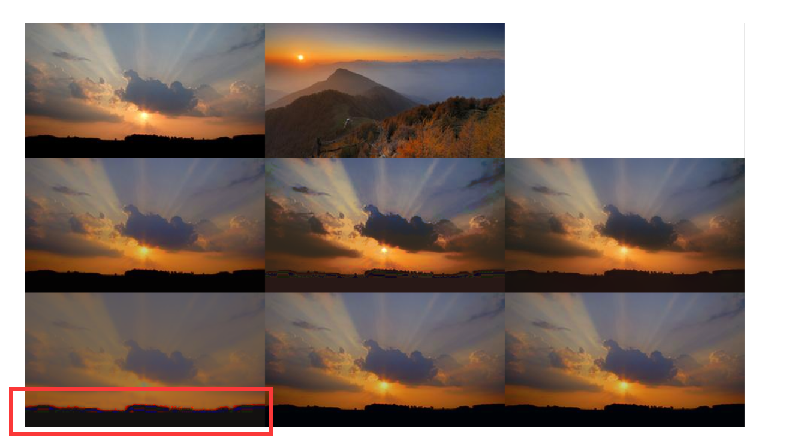
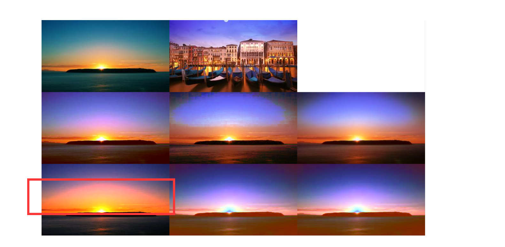
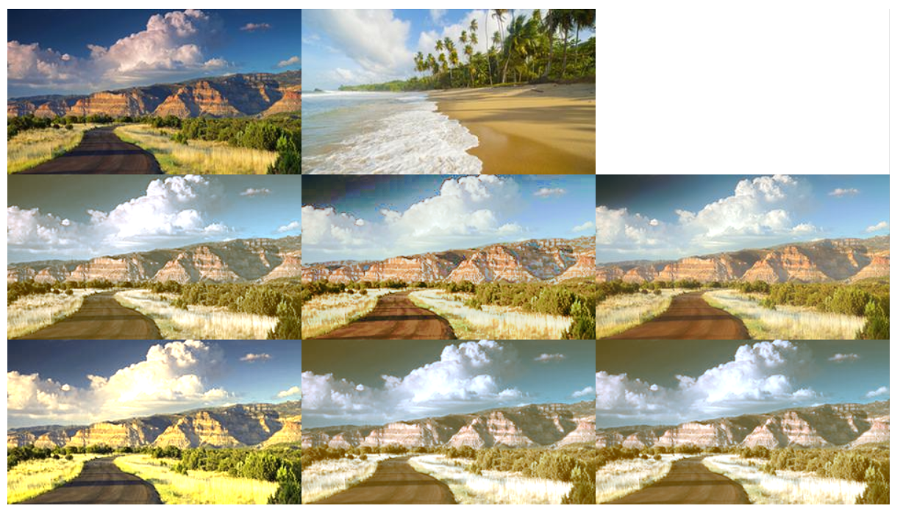
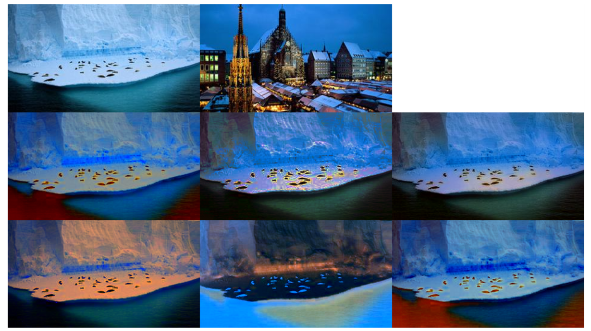
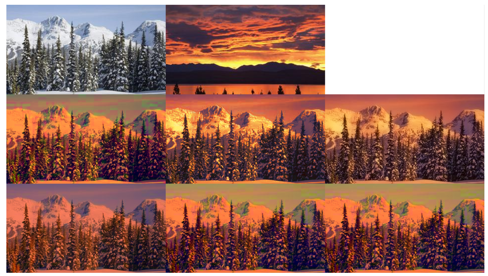

### 总述

比较了四种方法，分别为Reinhard的方法、Xiaoxuezhong的方法、Pitie的LMK和IDT方法。

测试了50张风景图片分别作为源图像和参考图像的2500种组合。

依照我个人的主观感受综合来讲，四种方法是可以给出效果排名的：IDT>LMK≈Xiao>Reinhard。

其参考文献如下：

###### Reinhard：

Erik Reinhard, Michael Ashikhmin, Bruce Gooch and Peter Shirley,  'Color Transfer between Images', IEEE CG&A special issue on Appliedi Perception, Vol 21, No 5, pp 34-41, September - October 2001

###### Xiaoxuezhong：

Xiao, Xuezhong, and Lizhuang Ma. "Color transfer in correlated color space." In Proceedings of the 2006 ACM international conference on  Virtual reality continuum and its applications, pp. 305-309. ACM, 2006.

###### LMK：

The linear Monge-Kantorovitch linear colour mapping forexample-based colour transfer.
F. Pitié and A. Kokaram (2007) In 4th IEE European Conference on Visual Media Production (CVMP'07).

###### IDT：

Automated colour grading using colour distribution transfer. 

F. Pitie , A. Kokaram and R. Dahyot (2007) Computer Vision and Image Understanding.

### 风景图片对比

以下提供的图片，所代表的顺序是

```
源图像  	参考图像   空白填充
LMK    	  IDT       加强IDT
Reinhard  Xiao		加强Xiao
```

大部分的对比结果显示是四种方法的效果相差不大，但是会受到一些因素的影响，这些影响因素包括了：

1、源图像和参考图像的相关度，相关度越强，则效果越好，四种方法的差距也就越小。

2、源图像的内容丰富度，当源图像中物体较多，或者边缘变化较强烈时，就会体现出四种方法的差异或者说是差距。

3、参考图像的色彩关联度，如果参考图像中具有多种不同风格的色彩，那么整体的迁移效果也会比较差。

4、其他未发现的。

以下举一些例子说明。

Reinhard的方法有个比较大的缺点就是在源图像（提供内容）的图像中，在颜色变化处（源图像是自然过渡的），Reinhard的方法生成的结果会有比较强的边缘感，如下图所示






Reinhard方法对细节的保留也比较差，如下图所示，Reinhard方法对于图像右下方的草细节保留很差。而Xiao的方法比Reinhard稍好，LMK再稍好些，而IDT方法就很好的保留了这些细节。



以下图像中，可以比较直观地感受到其他方法与IDT方法（第二排第三个）的差距，



下面这组图片中看上方天空，由于参考图像的上方云层的颜色变化比较丰富，LMK和Xiao方法的效果比较差，而IDT和Reinhard方法则很好地做到了迁移效果。这与上周我的结论“Xiao和LMK都要比IDT方法来的好”是相违背的，确实少量的测试说明不了什么。

